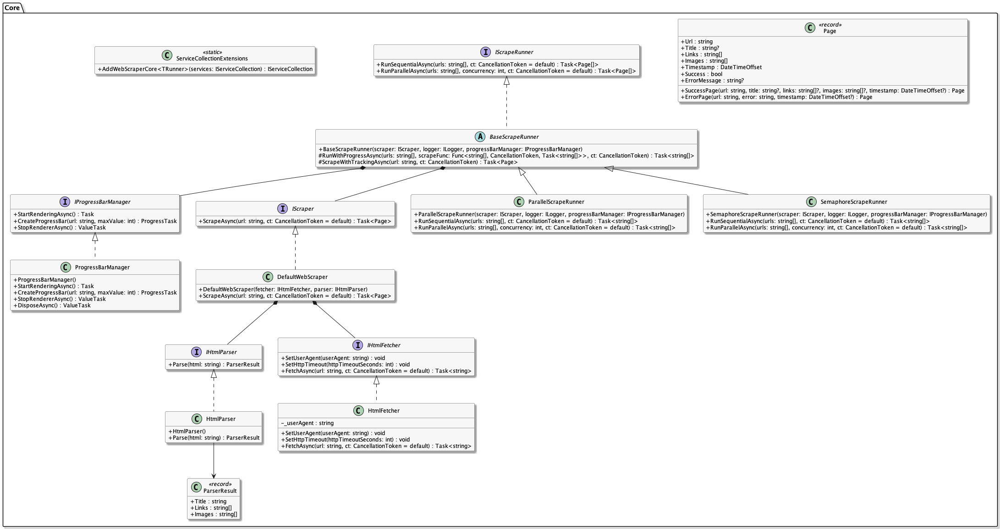
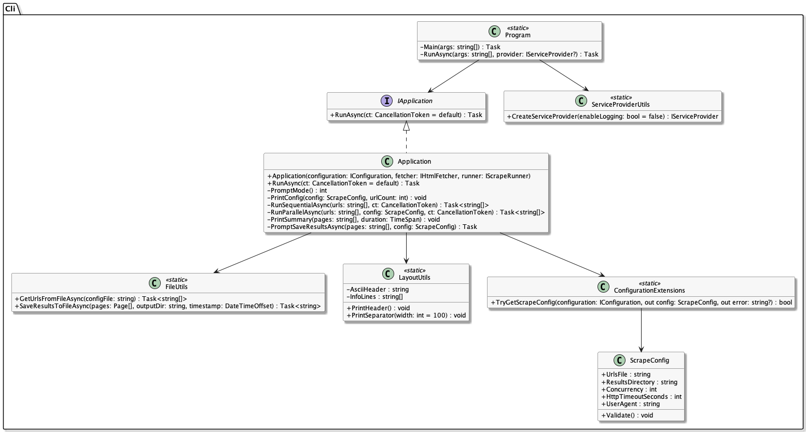

# 🕸️ Parallel Web Scraper: Comparing Parallel Programming in Go and C#
[](https://github.com/SimonLiebers-Dev/concepts-of-programming-languages/actions/workflows/csharp.yml)
[](https://github.com/SimonLiebers-Dev/concepts-of-programming-languages/actions/workflows/go.yml)

> This project was built as part of the course *Concepts of Programming Languages* at TH Rosenheim.

## 📚 Table of Contents

1. [Overview](#overview)  
2. [C# Implementation (.NET 9)](#csharp-implementation)  
   - [Architecture](#architecture-1)    
   - [Setup](#setup-1)  
   - [Configuration](#configuration-1)  
   - [Running](#running-1)  
   - [Testing](#testing-1)  
3. [Go Implementation](#go-implementation)    
   - [Setup](#setup-2)   
   - [Configuration](#configuration-2)  
   - [Running](#running-2)
   - [Testing](#testing-2)  
4. [License](#license)

## 🧩 Overview <a name="overview"></a>

The **Parallel Web Scraper** demonstrates two implementations of a parallel web scraping application — one in **C# (.NET 9)** and one in **Go 1.25** — to explore and compare the concepts of **parallel programming**, **asynchronous execution**, and **configuration-driven architectures** across different languages.

The main focus of this project lies on the **C# implementation**, which serves as a fully featured, extensible, and modular architecture. The **Go version** replicates its functionality to serve as a direct comparison for evaluating concurrency programming in both languages.

### ✨ Features

- **Parallel Scraping**  
  Executes multiple HTTP requests concurrently. The C# version offers two different strategies for parallel execution. Both strategies implement the same interface, allowing them to be easily interchanged through a generic setup method. The Go implementation leverages goroutines and channels for synchronization, following the [worker pool](https://gobyexample.com/worker-pools) pattern.

- **Modular Architecture**  
  Clear separation between core scraping logic (`WebScraper.Core`) and CLI application (`WebScraper.Cli`) in the C# implementation. The Go version mirrors this structure in a simpler form.

- **Configuration-driven Design**  
  Uses JSON-based configuration files (`appsettings.json` in C# and `config.json` in Go) to define the scraper’s behavior. The scraper’s behavior can be fully customized without modifying the source code. Configurable parameters include the path to the URL list file, the output directory for results, the level of concurrency, the HTTP request timeout, and the User-Agent string. Both the C# and Go versions load these settings at startup, ensuring flexible, consistent, and easily adjustable configurations.

- **Structured JSON Output**  
  Both implementations write results (list of urls with title, images, links) to a structured json file.

- **Error Handling**  
  Graceful error recovery with informative console output.

- **CLI Interface**  
  The C# CLI project implements a simple console UI that displays progress, timing, and summary results.

- **Testing Support**  
  Unit tests validate core logic, ensuring expected behavior.

## C# Implementation <a name="csharp-implementation"></a>

### 🏗️ Architecture <a name="architecture-1"></a>

The C# implementation of the **Parallel Web Scraper** is divided into two independent projects:

- **WebScraper.Core** — The reusable scraping library containing interfaces, services, and data models.  
- **WebScraper.Cli** — The command-line frontend that connects configuration, dependency injection, and user interaction.

This separation of concerns allows the scraping logic to be reused.

#### 🧩 WebScraper.Core

[`WebScraper.Core`](csharp/WebScraper.Core/WebScraper.Core.csproj) defines all reusable and testable components for scraping websites. It provides abstractions for fetching, parsing, running concurrent tasks, and reporting progress.



| Category | Key Types | Description |
|-----------|------------|-------------|
| **Scraping Logic** | [`IScraper`](csharp/WebScraper.Core/Scraping/IScraper.cs), [`DefaultScraper`](csharp/WebScraper.Core/Scraping/DefaultScraper.cs) | Defines the scraping workflow. The default implementation combines a `IHtmlFetcher` and `IHtmlParser` to extract metadata from HTML pages. |
| **Fetching** | `IHtmlFetcher`, `HtmlFetcher` | Handles HTTP requests with configurable timeout and user agent. |
| **Parsing** | `IHtmlParser`, `HtmlParser` | Extracts the title, links, and images from the downloaded HTML. |
| **Scrape Runners** | `IScrapeRunner`, `ParallelScrapeRunner`, `SemaphoreScrapeRunner` | Execute scraping sequentially or in parallel, providing interchangeable parallelization strategies. |
| **Progress Management** | `IProgressBarManager`, `ProgressBarManager` | Provides console-based progress visualization and manages concurrent progress bars for each URL. |
| **Models** | `Page`, `ParserResult` | Immutable records representing scraping results and parsed data. |
| **Dependency Injection** | `ServiceCollectionExtensions` | Registers all core services using a single generic extension method `AddWebScraperCore<TRunner>()`. |

#### 💻 WebScraper.Cli — Console Frontend

`WebScraper.Cli` serves as the interactive entry point for the user. It provides configuration loading, mode selection, progress display, and result output.



| Category | Key Types | Description |
|-----------|------------|-------------|
| **Program & Bootstrap** | `Program`, `ServiceProviderUtils` | Entry point that initializes the DI container and launches the application. |
| **Application Logic** | `Application`, `IApplication` | Orchestrates scraping sessions, handles user prompts, prints summaries, and manages flow control. |
| **Configuration** | `ScrapeConfig`, `ConfigurationExtensions` | Loads and validates runtime configuration (concurrency, timeouts, directories, etc.). |
| **Utilities** | `FileUtils`, `LayoutUtils` | Helper classes for file I/O and console formatting. |

The result is a clean, maintainable, and extensible architecture demonstrating modern .NET design patterns for parallel programming.

### ⚙️ Setup <a name="setup-1"></a>

Setting up the C# implementation requires the .NET 9 SDK. The project uses the built-in .NET CLI tools and has no external dependencies beyond those available via NuGet.

#### 🧰 Prerequisites
- [.NET 9 SDK](https://dotnet.microsoft.com/en-us/download/dotnet/9.0)
- A terminal or IDE such as Visual Studio Code or Rider

#### 🧱 Dependency Injection

All services are registered in [`ServiceProviderUtils.cs`](csharp/WebScraper.Cli/Util/ServiceProviderUtils.cs) using the extension method provided by the core library:

```csharp
services.AddWebScraperCore<ParallelScrapeRunner>();
```

This setup allows easy swapping of the runner by changing the generic parameter of [`AddWebScraperCore<>`](csharp/WebScraper.Core/DependencyInjection/ServiceCollectionExtensions.cs). The library offers two different implementations of the runner ([`ParallelScrapeRunner`](csharp/WebScraper.Core/Scraping/ParallelScrapeRunner.cs) and [`SemaphoreScrapeRunner`](csharp/WebScraper.Core/Scraping/SemaphoreScrapeRunner.cs)). You can use one of these implementations or provide a own implementation.

#### 📦 Installation & Build

Clone the repository:

```bash
git clone https://github.com/SimonLiebers-Dev/concepts-of-programming-languages.git
cd concepts-of-programming-languages/csharp/WebScraper.Cli
```

By default the path to the URLs JSON-File is configured to `urls.json` which is located in `csharp/WebScraper.Cli`. Without further configuration, ensure that you are running the following steps inside the folder `csharp/WebScraper.Cli`. Otherwise the file will not be found (in this case a new empty JSON file is created for you).

Build and run the application:

```bash
dotnet build
dotnet run
```

### ⚙️ Configuration <a name="configuration-1"></a>

The C# scraper uses two configuration files — `appsettings.json` and `urls.json` — to define runtime behavior and scraping targets. This approach makes the scraper highly adaptable.

#### Configuration file: [appsettings.json](csharp/WebScraper.Cli/appsettings.json)

This file contains global scraper settings such as concurrency level, timeouts, output directory, and user agent string.

```json
{
  "Scraper": {
    "UrlsFile": "urls.json",
    "ResultsDirectory": "output",
    "Concurrency": 5,
    "HttpTimeoutSeconds": 10,
    "UserAgent": "ParallelScraper/1.0"
  }
}
```

| Key | Description |
|------|--------------|
| **UrlsFile** | Path to the JSON file containing URLs to scrape. |
| **ResultsDirectory** | Directory where the results JSON file will be saved. |
| **Concurrency** | Maximum number of concurrent scraping tasks. |
| **HttpTimeoutSeconds** | Timeout (in seconds) for HTTP requests. |
| **UserAgent** | Custom User-Agent string used for requests. |

Configuration is automatically loaded and validated via [`ScrapeConfig`](csharp/WebScraper.Cli/Configuration/ScrapeConfig.cs) and [`ConfigurationExtensions`](csharp/WebScraper.Cli/Extensions/ConfigurationExtensions.cs):

```csharp
if (!ConfigurationExtensions.TryGetScrapeConfig(configuration, out var config, out var error))
{
    Console.WriteLine($"Configuration error: {error}");
    return;
}
```

#### Url file - Default: [urls.json](csharp/WebScraper.Cli/urls.json)

Defines the list of target URLs to scrape. Each URL is processed individually by the selected runner.

```json
[
  "https://example.com",
  "https://news.ycombinator.com",
  "https://dotnet.microsoft.com"
]
```

The scraper reads this file through [`FileUtils.GetUrlsFromFileAsync()`](csharp/WebScraper.Cli/Util/FileUtils.cs).

#### 🧪 Validation

Before execution, the configuration is validated by calling `ScrapeConfig.Validate()`. This ensures that all paths exist, concurrency levels are positive, etc. If validation fails, the CLI provides an error message and aborts execution safely.