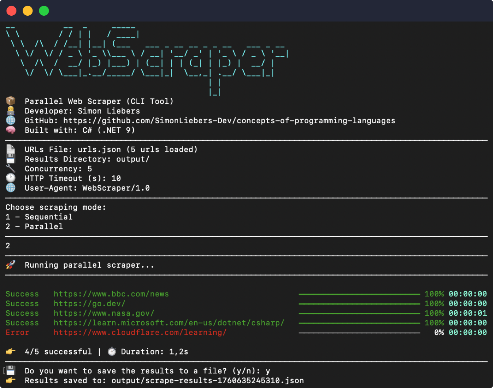
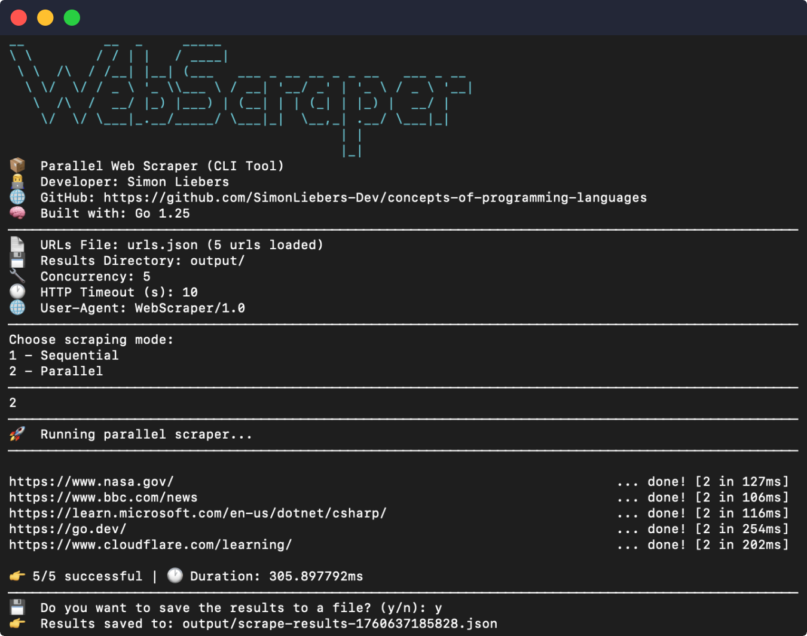

# 🕸️ Parallel Web Scraper: Comparing Parallel Programming in Go and C#
[](https://github.com/SimonLiebers-Dev/concepts-of-programming-languages/actions/workflows/csharp.yml)
[](https://github.com/SimonLiebers-Dev/concepts-of-programming-languages/actions/workflows/go.yml)

> This project was built as part of the course *Concepts of Programming Languages* at TH Rosenheim.

## Table of Contents

1. [Overview](#overview)  
2. [C# Implementation (.NET 9)](#csharp-implementation)  
   - [Architecture](#architecture-1)    
   - [Setup](#setup-1)  
   - [Configuration](#configuration-1)  
   - [Testing](#testing-1)  
3. [Go Implementation](#go-implementation)    
   - [Setup](#setup-2)   
   - [Configuration](#configuration-2)  
   - [Testing](#testing-2)  
4. [License](#license)

## Overview <a name="overview"></a>

The **Parallel Web Scraper** demonstrates two implementations of a parallel web scraping application — one in **C# (.NET 9)** and one in **Go 1.25** — to explore and compare the concepts of **parallel programming**, **asynchronous execution**, and **configuration-driven architectures** across different languages.

The main focus of this project lies on the **C# implementation**, which serves as a fully featured, extensible, and modular architecture. The **Go version** replicates its functionality to serve as a direct comparison for evaluating concurrency programming in both languages.

### Features

- **Parallel Scraping**  
  Executes multiple HTTP requests concurrently. The C# version offers two different strategies for parallel execution. Both strategies implement the same interface, allowing them to be easily interchanged through a generic setup method. The Go implementation leverages goroutines and channels for synchronization, following the [worker pool](https://gobyexample.com/worker-pools) pattern.

- **Modular Architecture**  
  Clear separation between core scraping logic (`WebScraper.Core`) and CLI application (`WebScraper.Cli`) in the C# implementation. The Go version mirrors this structure in a simpler form.

- **Configuration-driven Design**  
  Uses JSON-based configuration files (`appsettings.json` in C# and `config.json` in Go) to define the scraper’s behavior. The scraper’s behavior can be fully customized without modifying the source code. Configurable parameters include the path to the URL list file, the output directory for results, the level of concurrency, the HTTP request timeout, and the User-Agent string. Both the C# and Go versions load these settings at startup, ensuring flexible, consistent, and easily adjustable configurations.

- **Structured JSON Output**  
  Both implementations write results (list of urls with title, images, links) to a structured json file.

- **Error Handling**  
  Graceful error recovery with informative console output.

- **CLI Interface**  
  The C# CLI project implements a simple console UI that displays progress, timing, and summary results.

- **Testing Support**  
  Unit tests validate core logic, ensuring expected behavior.

## C# Implementation <a name="csharp-implementation"></a>

### Architecture <a name="architecture-1"></a>

The C# implementation of the **Parallel Web Scraper** is divided into two independent projects:

- **WebScraper.Core** — The reusable scraping library containing interfaces, services, and data models.  
- **WebScraper.Cli** — The command-line frontend that connects configuration, dependency injection, and user interaction.

This separation of concerns allows the scraping logic to be reused.

#### WebScraper.Core

[`WebScraper.Core`](csharp/WebScraper.Core/WebScraper.Core.csproj) defines all reusable and testable components for scraping websites. It provides abstractions for fetching, parsing, running concurrent tasks, and reporting progress.


> **Note:** The diagram intentionally omits explicit connections to the Page model and its related data flow.
While these links exist in the actual implementation, they would clutter the visual representation and make the class relationships less clear. The focus of this diagram is to highlight the core architectural structure. It shows how the main components interact (scraping, fetching, parsing, and progress reporting) without overloading it with data dependencies.

| Category | Key Types | Description |
|-----------|------------|-------------|
| **Scraping Logic** | [`IScraper`](csharp/WebScraper.Core/Scraping/IScraper.cs), [`DefaultScraper`](csharp/WebScraper.Core/Scraping/DefaultScraper.cs) | Defines the scraping workflow. The default implementation combines a `IHtmlFetcher` and `IHtmlParser` to extract metadata from HTML pages. |
| **Fetching** | [`IHtmlFetcher`](csharp/WebScraper.Core/Fetcher/IHtmlFetcher.cs), [`HtmlFetcher`](csharp/WebScraper.Core/Fetcher/HtmlFetcher.cs) | Handles HTTP requests with configurable timeout and user agent. |
| **Parsing** | [`IHtmlParser`](csharp/WebScraper.Core/Parser/IHtmlParser.cs), [`HtmlParser`](csharp/WebScraper.Core/Parser/HtmlParser.cs) | Extracts the title, links, and images from the downloaded HTML. |
| **Scrape Runners** | [`IScrapeRunner`](csharp/WebScraper.Core/Scraping/IScrapeRunner.cs), [`ParallelScrapeRunner`](csharp/WebScraper.Core/Scraping/ParallelScrapeRunner.cs), [`SemaphoreScrapeRunner`](csharp/WebScraper.Core/Scraping/SemaphoreScrapeRunner.cs) | Execute scraping sequentially or in parallel, providing interchangeable parallelization strategies. |
| **Progress Management** | [`IProgressBarManager`](csharp/WebScraper.Core/UI/IProgressBarManager.cs), [`ProgressBarManager`](csharp/WebScraper.Core/UI/ProgressBarManager.cs) | Provides console-based progress visualization and manages concurrent progress bars for each URL. |
| **Models** | [`Page`](csharp/WebScraper.Core/Models/Page.cs), [`ParserResult`](csharp/WebScraper.Core/Models/ParserResult.cs) | Immutable records representing scraping results and parsed data. |
| **Dependency Injection** | [`ServiceCollectionExtensions`](csharp/WebScraper.Core/DependencyInjection/ServiceCollectionExtensions.cs) | Registers all core services using a single generic extension method `AddWebScraperCore<TRunner>()`. |

#### WebScraper.Cli

`WebScraper.Cli` serves as the interactive entry point for the user. It provides configuration loading, mode selection, progress display, and result output.


| Category | Key Types | Description |
|-----------|------------|-------------|
| **Program & Bootstrap** | [`Program`](csharp/WebScraper.Cli/Program.cs), [`ServiceProviderUtils`](csharp/WebScraper.Cli/Util/ServiceProviderUtils.cs) | Entry point that initializes the DI container and launches the application. |
| **Application Logic** | [`Application`](csharp/WebScraper.Cli/App/Application.cs), [`IApplication`](csharp/WebScraper.Cli/App/IApplication.cs) | Orchestrates scraping sessions, handles user prompts, prints summaries, and manages flow control. |
| **Configuration** | [`ScrapeConfig`](csharp/WebScraper.Cli/Configuration/ScrapeConfig.cs), [`ConfigurationExtensions`](csharp/WebScraper.Cli/Extensions/ConfigurationExtensions.cs) | Loads and validates runtime configuration (concurrency, timeouts, directories, etc.). |
| **Utilities** | [`FileUtils`](csharp/WebScraper.Cli/Util/FileUtils.cs), [`LayoutUtils`](csharp/WebScraper.Cli/Util/LayoutUtils.cs) | Helper classes for file I/O and console formatting. |

The result is a clean, maintainable, and extensible architecture demonstrating modern .NET design patterns for parallel programming.

### Setup <a name="setup-1"></a>

Setting up the C# implementation requires the .NET 9 SDK. The project uses the built-in .NET CLI tools and has no external dependencies beyond those available via NuGet.

#### Prerequisites
- [.NET 9 SDK](https://dotnet.microsoft.com/en-us/download/dotnet/9.0)
- A terminal or IDE such as Visual Studio Code or Rider

#### Dependency Injection

All services are registered in [`ServiceProviderUtils.cs`](csharp/WebScraper.Cli/Util/ServiceProviderUtils.cs) using the extension method provided by the core library:

```csharp
services.AddWebScraperCore<ParallelScrapeRunner>();
```

This setup allows easy swapping of the runner by changing the generic parameter of [`AddWebScraperCore<>`](csharp/WebScraper.Core/DependencyInjection/ServiceCollectionExtensions.cs). The library offers two different implementations of the runner ([`ParallelScrapeRunner`](csharp/WebScraper.Core/Scraping/ParallelScrapeRunner.cs) and [`SemaphoreScrapeRunner`](csharp/WebScraper.Core/Scraping/SemaphoreScrapeRunner.cs)). You can use one of these implementations or provide a own implementation.

#### Build & Run

Clone the repository:

```bash
git clone https://github.com/SimonLiebers-Dev/concepts-of-programming-languages.git
cd concepts-of-programming-languages/csharp/WebScraper.Cli
```

By default the path to the URLs JSON-File is configured to `urls.json` which is located in `csharp/WebScraper.Cli`. Without further configuration, ensure that you are running the following steps inside the folder `csharp/WebScraper.Cli`. Otherwise the file will not be found (in this case a new empty JSON file is created for you).

Build and run the application:

```bash
dotnet build
dotnet run
```

The application will:
1. Display an ASCII banner and configuration summary.
2. Load all URLs from the provided JSON file.
3. Prompt for the scraping mode (sequential or parallel).
4. Execute the selected mode with live progress bars for each URL.
5. Summarize results and optionally save them to an output file.

The results are stored in the configured `ResultsDirectory` with a timestamped filename (e.g., `scrape-results-1760563678815.json`).

#### Example Output



### Configuration <a name="configuration-1"></a>

The C# scraper uses two configuration files — `appsettings.json` and `urls.json` — to define runtime behavior and scraping targets. This approach makes the scraper highly adaptable.

#### Configuration file: [appsettings.json](csharp/WebScraper.Cli/appsettings.json)

This file contains global scraper settings such as concurrency level, timeouts, output directory, and user agent string.

```jsonc
{
  "Scraper": {
    "UrlsFile": "urls.json",            // Path to the JSON file containing URLs to scrape
    "ResultsDirectory": "output",       // Directory where the results JSON file will be saved
    "Concurrency": 5,                   // Maximum number of concurrent scraping tasks
    "HttpTimeoutSeconds": 10,           // Timeout (in seconds) for HTTP requests
    "UserAgent": "ParallelScraper/1.0"  // Custom User-Agent string used for requests
  }
}
```

Configuration is automatically loaded and validated via [`ScrapeConfig`](csharp/WebScraper.Cli/Configuration/ScrapeConfig.cs) and [`ConfigurationExtensions`](csharp/WebScraper.Cli/Extensions/ConfigurationExtensions.cs):

```csharp
if (!ConfigurationExtensions.TryGetScrapeConfig(configuration, out var config, out var error))
{
    Console.WriteLine($"Configuration error: {error}");
    return;
}
```

#### Url file - Default: [urls.json](csharp/WebScraper.Cli/urls.json)

Defines the list of target URLs to scrape. Each URL is processed individually by the selected runner.

```jsonc
[
  "https://go.dev",
  "https://dotnet.microsoft.com"
]
```

The scraper reads this file through [`FileUtils.GetUrlsFromFileAsync()`](csharp/WebScraper.Cli/Util/FileUtils.cs).

#### Validation

Before execution, the configuration is validated by calling `ScrapeConfig.Validate()`. This ensures that all paths exist, concurrency levels are positive, etc. If validation fails, the CLI provides an error message and aborts execution safely.

### Testing <a name="testing-1"></a>

Testing in the C# implementation is organized into two independent projects to ensure a clear separation of concerns between the **core logic** and the **CLI layer**.

| Test Project | Purpose |
|---------------|----------|
| [**WebScraper.Core.Tests**](csharp/WebScraper.Core.Tests/WebScraper.Core.Tests.csproj) | Focuses on verifying the functionality of the reusable library components such as scraping, fetching, parsing, progress tracking, and concurrency handling. This ensures the core engine behaves correctly under different configurations and concurrency models. |
| [**WebScraper.Cli.Tests**](csharp/WebScraper.Cli.Tests/WebScraper.Cli.Tests.csproj) | Tests the console application layer, including configuration loading, integration with the core library, and basic flow control. It validates that the CLI correctly orchestrates services, processes user input, and handles output. |

Both test projects are designed to run independently, allowing developers to validate either the core library or the CLI in isolation. Together, they provide full coverage of the scraper’s runtime behavior.

All tests can be executed from the `csharp` directory with a single command:

```bash
dotnet test
```

This command automatically discovers and runs tests from both projects. Tests are automatically executed in the CI workflow via [`csharp.yml`](.github/workflows/csharp.yml).

## Go Implementation <a name="go-implementation"></a>

The **Go implementation** serves as a lightweight equivalent of the C# scraper and focuses primarily on showcasing **Go’s concurrency model** using goroutines and channels. While architecturally simpler, it preserves the same external behavior and configuration-driven execution model as the C# version.

### Setup <a name="setup-2"></a>

#### Prerequisites
- [Go 1.25+](https://go.dev/dl/)
- Terminal or IDE with Go module support (VS Code, GoLand, etc.)

#### Installation

Clone the repository and navigate to the Go project directory:

```bash
git clone https://github.com/SimonLiebers-Dev/concepts-of-programming-languages.git
cd concepts-of-programming-languages/go

# Download dependencies
go mod tidy
```

Build and run the scraper:

```bash
go run .
```

By default, the scraper expects configuration files (`config.json` and `urls.json`) to be located in the same directory as `main.go`.

#### Example Output



### Configuration <a name="configuration-2"></a>

The Go scraper reads its configuration from two JSON files: `config.json` and `urls.json`. Both mirror the structure and intent of the C# equivalents.

#### Configuration file: [config.json](go/config.json)

```jsonc
{
  "urlsFile": "urls.json",            // Path to the JSON file containing URLs to scrape
  "resultsDirectory": "output",       // Directory where the results JSON file will be saved
  "concurrency": 5,                   // Maximum number of concurrent scraping tasks
  "httpTimeoutSeconds": 10,           // Timeout (in seconds) for HTTP requests
  "userAgent": "ParallelScraper/1.0"  // Custom User-Agent string used for requests
}
```

#### Url file - Default: [urls.json](go/urls.json)

```jsonc
[
  "https://go.dev",
  "https://dotnet.microsoft.com"
]
```

### Testing <a name="testing-2"></a>

The Go implementation includes lightweight tests that verify correctness and scraping logic.

Run all tests with:

```bash
go test ./...
```

This command executes all tests within the `go` module, providing a summary of passed and failed tests.
Like the C# implementation, tests are also automatically executed in the CI workflow via [`go.yml`](.github/workflows/go.yml).

## References

- [Goroutines and Channels (Go Blog)](https://go.dev/doc/effective_go#goroutines)
- [Worker Pool Pattern in Go](https://gobyexample.com/worker-pools)
- [Asynchronous Programming with async and await (Microsoft Docs)](https://learn.microsoft.com/en-us/dotnet/csharp/programming-guide/concepts/async/)
- [Dependency Injection in .NET](https://learn.microsoft.com/en-us/dotnet/core/extensions/dependency-injection)
- [PlantUML Documentation](https://plantuml.com/class-diagram)

## License <a name="license"></a>

The MIT License (MIT) - see [LICENSE](LICENSE) for more details